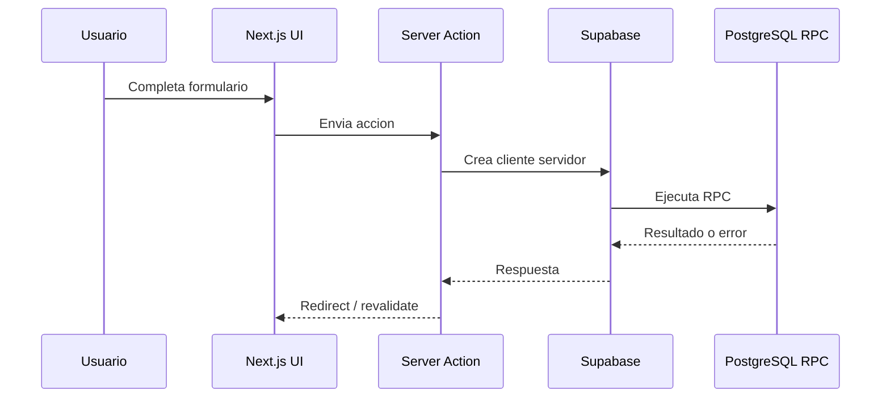
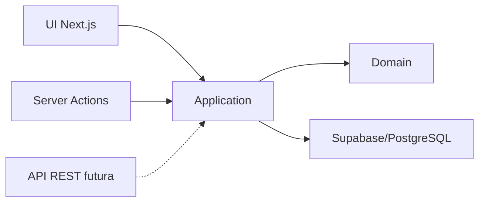

# Decisiones de API e integracion

Este documento explica como se comunican las partes del sistema y por que el MVP
no expone una API REST publica tradicional en esta etapa.

## Resumen

El proyecto usa:

```txt
Next.js Server Actions
Supabase client/server
PostgreSQL RPC
```

No usa todavia:

```txt
API REST publica
OpenAPI/Swagger
Backend separado
Microservicios
```

Decision principal:

```txt
Para un MVP web full stack, Server Actions + Supabase RPC reducen complejidad y
permiten entregar valor mas rapido.
```

## Flujo de comunicacion actual



Ejemplo real:

```txt
ProductOrderPanel
-> createOrder
-> supabase.rpc("create_order")
-> public.create_order en PostgreSQL
```

Archivos:

```txt
src/components/products/product-order-panel.tsx
src/actions/orders.ts
src/lib/supabase/server.ts
supabase/migrations/202605220002_stock_reservation.sql
```

## Que es una Server Action

En Next.js, una Server Action es una funcion que se ejecuta en el servidor y se
puede llamar desde formularios o componentes.

Ejemplo:

```txt
src/actions/orders.ts
```

Ventajas:

- evita crear endpoints manuales para cada formulario;
- permite validar datos en servidor;
- permite usar cookies/session de forma segura;
- se integra bien con App Router;
- simplifica el MVP.

Limitacion:

```txt
No es una API publica pensada para clientes externos.
```

## Que es una RPC en Supabase/PostgreSQL

RPC significa Remote Procedure Call.

En este proyecto, una RPC es una funcion SQL ejecutada desde Supabase:

```txt
create_order
approve_order
reject_order
cancel_order
```

Ejemplo en codigo:

```ts
await supabase.rpc("create_order", {
  p_idempotency_key,
  p_items,
  p_notes,
});
```

Ventajas:

- ejecuta logica cerca de los datos;
- permite transacciones atomicas;
- centraliza reglas criticas;
- protege stock y pedidos duplicados;
- respeta Auth/RLS segun configuracion.

Limitacion:

```txt
La logica SQL puede crecer demasiado si no se documenta y organiza.
```

## Por que no usamos REST todavia

REST es util cuando:

- hay clientes externos;
- existe una app movil independiente;
- otro sistema consume datos;
- se necesita versionado publico;
- se requiere OpenAPI/Swagger;
- el backend esta separado del frontend.

Este MVP actualmente es:

```txt
Una aplicacion web full stack controlada por el mismo proyecto Next.js.
```

Por eso, crear REST ahora agregaria:

- mas rutas;
- mas validacion duplicada;
- mas superficie de seguridad;
- mas documentacion obligatoria;
- mas mantenimiento.

Decision:

```txt
No se implementa REST hasta que exista una necesidad real de integracion externa.
```

## Comparacion REST vs Server Actions + RPC

| Criterio | REST | Server Actions + RPC |
| --- | --- | --- |
| Cliente externo | Muy bueno | No ideal |
| MVP web rapido | Mas trabajo | Mas simple |
| OpenAPI/Swagger | Natural | No aplica directo |
| Formularios internos | Requiere endpoint | Directo |
| Transacciones de stock | Backend debe coordinar | PostgreSQL coordina |
| Seguridad | HTTP + auth + validacion | Auth + server + RLS/RPC |
| Escalabilidad futura | Buena | Buena para monolito modular |

## Donde estan las integraciones actuales

### Auth

```txt
Supabase Auth
```

Archivos:

```txt
src/actions/auth.ts
src/lib/auth.ts
src/lib/supabase/server.ts
src/lib/supabase/middleware.ts
```

### Base de datos

```txt
Supabase PostgreSQL
```

Archivos:

```txt
src/lib/data.ts
src/actions/orders.ts
src/actions/products.ts
src/actions/sellers.ts
supabase/migrations
```

### Deploy

```txt
Vercel
```

Archivo:

```txt
docs/deployment-vercel.md
```

### Versionado

```txt
GitHub
GitLab
```

Archivo:

```txt
docs/git-workflow.md
```

## Posible API REST futura

Si el sistema necesita integrarse con app movil o terceros, se podria agregar:

```txt
src/app/api/products/route.ts
src/app/api/orders/route.ts
src/app/api/orders/[id]/route.ts
src/app/api/sellers/route.ts
src/app/api/reports/route.ts
```

Ejemplos de endpoints:

```txt
GET /api/products
GET /api/orders
POST /api/orders
PATCH /api/orders/:id/approve
PATCH /api/orders/:id/reject
GET /api/sellers
```

Pero esos endpoints deberian llamar casos de uso, no duplicar reglas:

```txt
API route -> application use case -> domain / infrastructure
```

## Posible OpenAPI futura

Si se crea REST, conviene documentar con:

```txt
OpenAPI
Swagger UI
Zod schemas compartidos
```

Esto permitiria:

- documentar contratos;
- probar endpoints;
- generar clientes;
- compartir API con otros equipos.

## Como encaja con arquitectura hexagonal

En arquitectura hexagonal, REST seria un adaptador de entrada.

Actualmente los adaptadores de entrada son:

```txt
Next.js pages/components
Server Actions
```

Los adaptadores de salida son:

```txt
Supabase
PostgreSQL RPC
```

Diagrama:



Regla:

```txt
Si agregamos REST, no debe reemplazar el dominio; debe conectarse a los mismos
casos de uso.
```

## Decision Architecture Decision Record

### ADR-001: No crear REST publica en el MVP

Contexto:

```txt
El MVP es una web Next.js usada por vendedores y administradores desde navegador.
```

Decision:

```txt
Usar Server Actions para operaciones web internas y RPC para reglas
transaccionales en PostgreSQL.
```

Consecuencias positivas:

- menos codigo repetido;
- menos endpoints expuestos;
- entrega mas rapida;
- mejor atomicidad en stock/pedidos;
- menor complejidad inicial.

Consecuencias negativas:

- no hay API publica para apps externas;
- no hay OpenAPI;
- una futura app movil requeriria crear capa API o backend separado.

Mitigacion:

```txt
El proyecto ya separa dominio/aplicacion gradualmente. Eso permite agregar REST
despues sin reescribir reglas de negocio.
```

## Como defenderlo

Respuesta corta:

```txt
No usamos REST todavia porque el MVP es una web full stack. Usamos Server Actions
para formularios internos y RPC en PostgreSQL para operaciones transaccionales.
```

Respuesta tecnica:

```txt
Las Server Actions reciben datos del formulario, validan en servidor y llaman RPC
de Supabase. Las RPC manejan reglas criticas como crear pedidos, evitar duplicados
y reservar stock de forma atomica.
```

Respuesta si preguntan por futuro:

```txt
Si aparece una app movil o integracion externa, agregaremos API REST como
adaptador de entrada, reutilizando los casos de uso y reglas de dominio ya
separadas.
```
