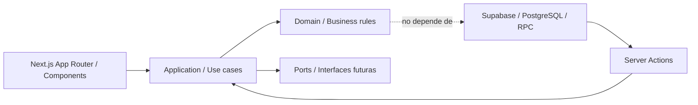

# Arquitectura DDD + Hexagonal aplicada

## Objetivo

El MVP se mantiene como un monolito full stack con Next.js y Supabase, pero su
codigo empieza a organizarse por responsabilidades de arquitectura:

```txt
Presentacion -> Aplicacion -> Dominio
                 Infraestructura
```

La meta no es sobreingenieria. La meta es que las reglas importantes del negocio
de Andina de Alimentos no queden mezcladas con componentes visuales, Supabase o
rutas de Next.js.

## Estilo arquitectonico

El proyecto usa una version pragmatica de arquitectura hexagonal:



Regla principal:

```txt
El dominio no debe importar Supabase, React, Next.js ni FormData.
```

## Capas del proyecto

### Presentacion

```txt
src/app
src/components
```

Responsabilidad:

- mostrar pantallas;
- capturar formularios;
- mostrar estados y mensajes;
- llamar Server Actions o casos de uso de aplicacion.

No deberia contener reglas complejas de negocio.

### Aplicacion

```txt
src/application
```

Responsabilidad:

- representar casos de uso;
- adaptar datos externos al lenguaje del dominio;
- coordinar reglas de dominio.

Ejemplo actual:

```txt
src/application/orders/calculate-order-estimate.ts
```

Este caso de uso recibe productos como vienen de la app y los transforma a
objetos del dominio antes de calcular el total.

### Dominio

```txt
src/domain
```

Responsabilidad:

- reglas puras de negocio;
- entidades;
- value objects;
- calculos;
- estados validos;
- decisiones independientes de frameworks.

Ejemplo actual:

```txt
src/domain/orders/pricing.ts
```

Contiene la regla de negocio:

```txt
precio aplicable = precio promocional si existe, si no precio base
descuento aplicable = mayor descuento activo que cumpla cantidad minima
total estimado = cantidad * precio aplicable * descuento
```

### Infraestructura

```txt
src/lib/supabase
supabase/migrations
```

Responsabilidad:

- conexion a Supabase;
- funciones RPC;
- RLS;
- estructura PostgreSQL;
- persistencia.

Actualmente las reglas transaccionales fuertes, como reserva de stock, viven en
PostgreSQL porque necesitan atomicidad.

## Bounded contexts

Para este negocio se identifican estos contextos:

```txt
Catalogo
- productos
- precios
- promociones

Pedidos
- ordenes
- items
- descuentos
- estados

Inventario
- stock
- reserva temporal
- restauracion por rechazo/cancelacion

Vendedores
- perfiles
- activacion
- estado

Administracion
- aprobacion
- rechazo
- control operativo
```

## Entidades y value objects

Entidades actuales:

```txt
Product
DiscountRule
Order
OrderItem
Seller/Profile
```

Value objects recomendados:

```txt
Money
Quantity
Sku
OrderStatus
Email
Phone
```

El proyecto ya usa algunos valores tipados de forma inicial:

```txt
OrderStatus
UserRole
ProductPricingSnapshot
OrderDraftItem
```

## Decisiones importantes

### Decision 1: Mantener monolito modular

El sistema no necesita microservicios todavia. El costo de separar backend,
frontend, colas y servicios externos seria mayor que el beneficio para este MVP.

### Decision 2: PostgreSQL conserva reglas transaccionales

La reserva temporal de stock se mantiene en funciones SQL/RPC porque debe ser
atomica:

```txt
crear pedido -> descontar stock -> marcar stock_reserved
rechazar/cancelar -> restaurar stock
aprobar -> confirmar sin doble descuento
```

### Decision 3: Extraer dominio gradualmente

No se reescribe todo. Se extraen reglas una por una:

```txt
1. Calculo de total estimado
2. Estados y transiciones de pedidos
3. Validacion de stock
4. Auditoria de inventario
5. Notificaciones por eventos
```

## Primer caso aplicado

Antes:

```txt
src/lib/orders/pricing.ts
```

La logica de precio era un helper tecnico ligado al modelo de datos de la app.

Ahora:

```txt
src/domain/orders/pricing.ts
src/application/orders/calculate-order-estimate.ts
```

Flujo:

```txt
ProductOrderPanel
-> calculateEstimatedOrderTotal
-> calculateOrderEstimate
```

Esto permite probar la regla de negocio sin depender de React, Supabase ni
Next.js.

## Como defenderlo en exposicion

Frase corta:

```txt
Aplicamos DDD y arquitectura hexagonal de forma incremental. El dominio contiene
reglas puras del negocio, aplicacion coordina casos de uso y Next/Supabase quedan
en los bordes como adaptadores.
```

Ejemplo concreto:

```txt
El calculo del total estimado de un pedido ya no depende de la UI ni de Supabase.
La pantalla solo llama un caso de uso, y el caso de uso delega la regla al
dominio.
```

## Proximos refactors recomendados

1. Extraer transiciones de estado del pedido:

```txt
pending -> approved
pending -> rejected
pending -> cancelled
```

2. Crear eventos de dominio:

```txt
OrderCreated
OrderApproved
OrderRejected
StockReserved
StockReleased
```

3. Crear auditoria:

```txt
inventory_movements
product_price_history
```

4. Crear casos de uso:

```txt
approveOrder
rejectOrder
cancelOrder
updateProductPrice
adjustStock
```
