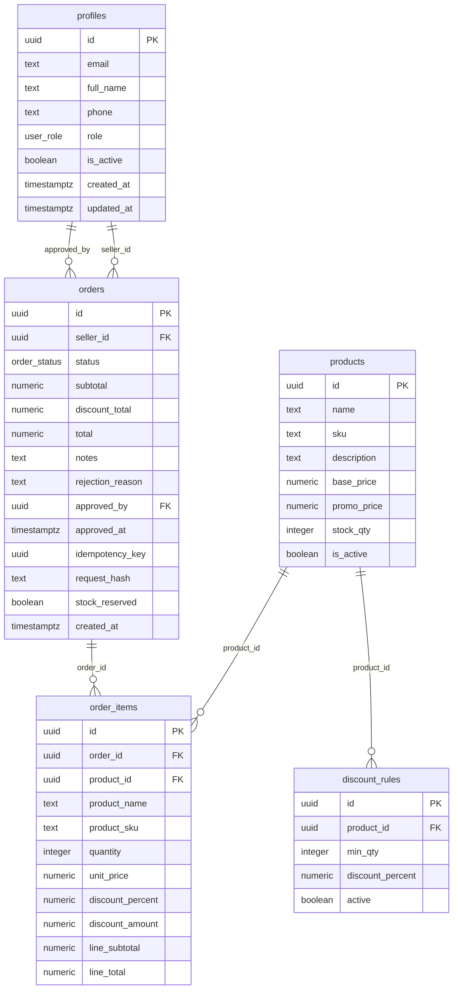

# Diseno de base de datos

Este documento explica el modelo de datos de Andina de Alimentos, las relaciones,
las reglas de integridad, las politicas de seguridad y las funciones SQL que
sostienen las operaciones criticas del MVP.

## Objetivo de la base de datos

La base de datos no solo guarda informacion. En este proyecto tambien protege
reglas importantes:

- usuarios y roles;
- productos y promociones;
- pedidos e items;
- descuentos por cantidad;
- stock disponible;
- reserva temporal de stock;
- prevencion de pedidos duplicados;
- seguridad con Row Level Security.

## Tecnologia

```txt
PostgreSQL
Supabase Auth
Supabase Row Level Security
Funciones RPC en PL/pgSQL
Migraciones SQL versionadas
```

## Diagrama general



## Tablas principales

### profiles

Representa los usuarios de negocio del sistema.

Relacion:

```txt
profiles.id -> auth.users.id
```

Campos importantes:

```txt
role: admin | seller
is_active: controla si el vendedor puede operar
```

Regla:

```txt
Un usuario puede existir en Supabase Auth, pero si su profile no esta activo no
puede vender.
```

### products

Representa el catalogo de productos congelados.

Campos importantes:

```txt
base_price
promo_price
stock_qty
is_active
sku
```

Restricciones:

```txt
base_price >= 0
promo_price >= 0
promo_price <= base_price
stock_qty >= 0
sku unico
```

Decision:

```txt
El stock actual esta en products.stock_qty porque el MVP maneja un solo almacen.
```

Escalabilidad futura:

```txt
Si hay varios almacenes, stock_qty debe migrar a warehouse_stock.
```

### discount_rules

Define descuentos por cantidad.

Ejemplo:

```txt
24 unidades -> 5%
48 unidades -> 10%
```

Relacion:

```txt
discount_rules.product_id -> products.id
```

Restricciones:

```txt
min_qty > 0
discount_percent entre 0 y 100
unique(product_id, min_qty)
```

### orders

Representa el pedido del vendedor.

Campos importantes:

```txt
seller_id
status
subtotal
discount_total
total
notes
rejection_reason
idempotency_key
request_hash
stock_reserved
```

Estados:

```txt
pending
approved
rejected
cancelled
```

Reglas:

```txt
Un pedido nace como pending.
Solo pending puede aprobarse, rechazarse o cancelarse.
Pedidos approved, rejected y cancelled son estados finales.
```

### order_items

Representa los productos dentro de un pedido.

Campos congelados:

```txt
product_name
product_sku
unit_price
discount_percent
discount_amount
line_subtotal
line_total
```

Decision:

```txt
Se guardan nombre, sku, precio y descuento del momento del pedido para conservar
historial aunque luego cambie el producto.
```

## Tipos ENUM

### user_role

```sql
admin
seller
```

### order_status

```sql
pending
approved
rejected
cancelled
```

Ventaja:

```txt
La base de datos no acepta estados o roles fuera de los permitidos.
```

## Indices

Indices iniciales:

```txt
profiles_role_idx
products_active_idx
orders_seller_id_idx
orders_status_idx
order_items_order_id_idx
discount_rules_product_id_idx
```

Indices de seguridad contra duplicados:

```txt
orders_seller_idempotency_key_uidx
orders_seller_pending_request_hash_uidx
```

Uso:

```txt
orders_seller_idempotency_key_uidx evita repetir el mismo envio.
orders_seller_pending_request_hash_uidx evita repetir el mismo pedido pendiente.
```

## Funciones auxiliares

### set_updated_at

Actualiza `updated_at` automaticamente cuando se modifica una fila.

### handle_new_user

Cuando Supabase Auth crea un usuario, esta funcion crea su profile.

### current_user_role

Devuelve el rol del usuario autenticado.

### is_admin

Devuelve `true` si el usuario actual es administrador.

### is_active_seller

Devuelve `true` si el usuario actual es vendedor activo.

## Funciones RPC principales

Las RPC concentran operaciones criticas de negocio en PostgreSQL.

### create_order

Responsabilidad:

```txt
Crear pedido, calcular totales, prevenir duplicados y reservar stock.
```

Valida:

- usuario autenticado;
- vendedor activo;
- lista de productos no vacia;
- cantidades positivas;
- productos existentes y activos;
- stock suficiente;
- duplicados por `idempotency_key`;
- duplicados por `request_hash`.

Operaciones:

1. Agrupa items por producto.
2. Calcula precio aplicable.
3. Aplica mejor descuento activo.
4. Inserta `orders`.
5. Inserta `order_items`.
6. Calcula subtotal, descuento y total.
7. Descuenta stock.
8. Marca `stock_reserved = true`.

### approve_order

Responsabilidad:

```txt
Aprobar pedido pendiente.
```

Regla:

```txt
Si stock_reserved ya es true, no descuenta otra vez.
```

Esto evita doble descuento.

### reject_order

Responsabilidad:

```txt
Rechazar pedido pendiente.
```

Regla:

```txt
Si el stock estaba reservado, se restaura.
```

### cancel_order

Responsabilidad:

```txt
Permitir que el vendedor cancele su propio pedido pendiente.
```

Regla:

```txt
Solo puede cancelar pedidos propios y pendientes.
Si habia stock reservado, se restaura.
```

## Prevencion de pedidos duplicados

Problema:

```txt
Un vendedor puede hacer doble clic o repetir solicitud por mala conexion.
```

Solucion frontend:

```txt
El boton se deshabilita al enviar.
```

Solucion backend:

```txt
idempotency_key
request_hash
indices unicos parciales
```

Explicacion:

```txt
idempotency_key identifica un intento de envio.
request_hash identifica contenido equivalente del pedido pendiente.
```

Esto protege incluso si el navegador falla o la solicitud llega dos veces.

## Reserva temporal de stock

Problema:

```txt
Varios vendedores pueden pedir el mismo producto antes de que el admin apruebe.
```

Solucion:

```txt
El stock se descuenta al crear pedido pendiente.
```

Estados:

```txt
Pedido creado -> stock reservado
Pedido aprobado -> reserva confirmada
Pedido rechazado -> stock restaurado
Pedido cancelado -> stock restaurado
```

Campo clave:

```txt
orders.stock_reserved
```

## Row Level Security

RLS esta activado en:

```txt
profiles
products
discount_rules
orders
order_items
```

Politicas principales:

### profiles_select_own_or_admin

```txt
Un usuario ve su propio perfil.
Admin ve todos.
```

### profiles_update_admin

```txt
Solo admin actualiza perfiles.
```

### products_select_active_seller_or_admin

```txt
Admin ve productos.
Vendedor activo ve productos activos.
```

### products_admin_insert/update/delete

```txt
Solo admin modifica catalogo.
```

### orders_select_owner_or_admin

```txt
Vendedor ve sus pedidos.
Admin ve todos.
```

### order_items_select_owner_or_admin

```txt
Vendedor ve items de sus pedidos.
Admin ve todos.
```

Frase para defender:

```txt
RLS protege desde la base de datos. Aunque alguien intente consultar directamente
Supabase, las politicas limitan que puede ver o modificar.
```

## Migraciones

### 202605190001_initial_schema.sql

Incluye:

- tablas principales;
- enums;
- triggers;
- RLS;
- funciones RPC iniciales;
- productos iniciales;
- reglas de descuento iniciales.

### 202605220001_order_safety.sql

Incluye:

- `idempotency_key`;
- `request_hash`;
- indices unicos contra duplicados;
- errores claros de stock;
- nueva firma de `create_order`.

### 202605220002_stock_reservation.sql

Incluye:

- `stock_reserved`;
- reserva temporal de stock;
- restauracion al rechazar o cancelar;
- aprobacion sin doble descuento.

## Verificacion despues de migrar

Archivo:

```txt
supabase/verify_after_migration.sql
```

Sirve para revisar:

- tablas existentes;
- productos iniciales;
- reglas de descuento;
- columnas nuevas;
- indices de duplicados.

Luego de ejecutar migraciones en Supabase:

```sql
NOTIFY pgrst, 'reload schema';
```

Esto recarga el schema cache de PostgREST/Supabase.

## Decisiones de diseno

### Por que usar funciones SQL para pedidos

Porque crear, aprobar, rechazar y cancelar pedidos son operaciones
transaccionales.

Ejemplo:

```txt
crear pedido + insertar items + calcular total + descontar stock
```

Debe ocurrir todo junto o nada.

### Por que guardar precio en order_items

Porque el precio del producto puede cambiar despues.

Si no guardamos precio historico, un pedido viejo podria mostrar valores
incorrectos.

### Por que usar RLS

Porque el frontend no debe ser la unica barrera de seguridad.

### Por que stock en products

Porque el MVP tiene un unico inventario. Es simple y suficiente por ahora.

## Limites actuales

El modelo todavia no incluye:

- almacenes multiples;
- lotes;
- vencimientos;
- movimientos historicos de inventario;
- auditoria de cambios de precio;
- comisiones;
- rutas de entrega.

Estos elementos estan identificados en:

```txt
docs/scaling-roadmap.md
```

## Como defenderlo

Respuesta corta:

```txt
La base de datos modela usuarios, productos, descuentos, pedidos e items. Ademas
usa RLS para seguridad y funciones RPC para operaciones criticas como crear
pedido, reservar stock, aprobar, rechazar y cancelar.
```

Respuesta tecnica:

```txt
PostgreSQL maneja integridad con foreign keys, checks, enums, indices y
transacciones. Las operaciones criticas no dependen solo del frontend, sino que
se validan en funciones SQL con seguridad y atomicidad.
```

Respuesta sobre escalabilidad:

```txt
El modelo actual es adecuado para un MVP con un solo almacen. Si la empresa crece,
el siguiente paso seria separar stock por almacenes y registrar movimientos de
inventario.
```
