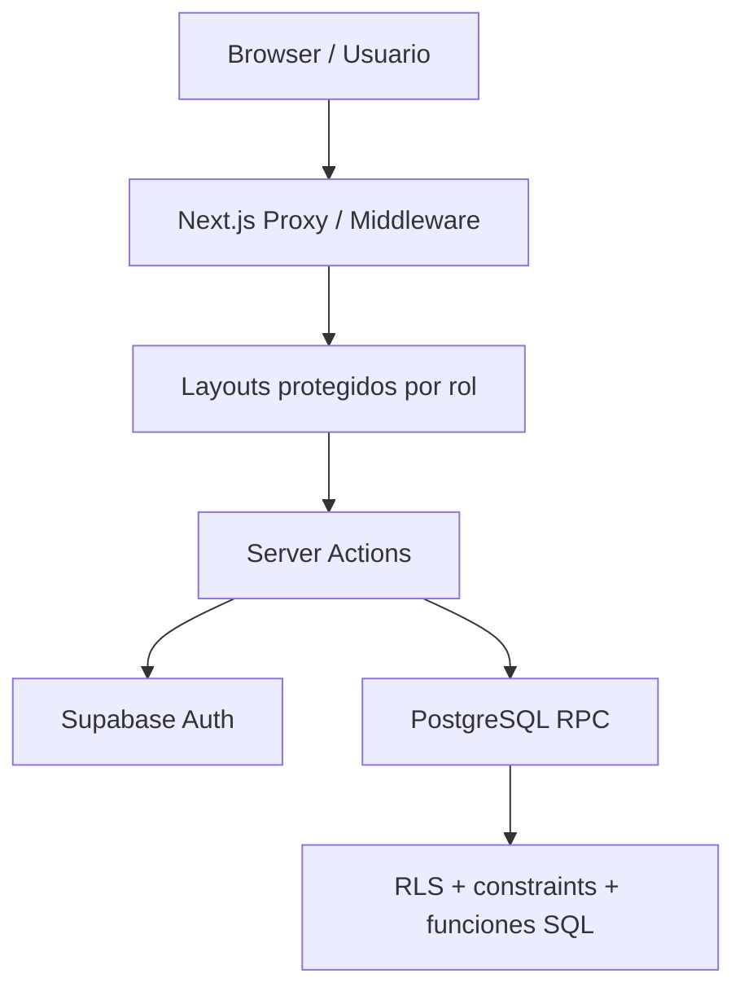

# Modelo de seguridad

Este documento explica como el MVP protege usuarios, rutas, datos y operaciones
criticas. La idea principal es que la seguridad no depende de una sola capa.

## Objetivo

```txt
Evitar accesos no autorizados, proteger datos por rol y validar operaciones
criticas en servidor y base de datos.
```

## Capas de seguridad



Capas:

```txt
1. Supabase Auth
2. Middleware de Next.js
3. Layouts por rol
4. Server Actions
5. Validadores Zod
6. PostgreSQL RLS
7. Funciones RPC
8. Constraints e indices
```

## Roles del sistema

Tipos:

```txt
admin
seller
```

Archivo:

```txt
src/types/domain.ts
```

Tabla:

```txt
profiles.role
```

Regla:

```txt
El rol del usuario no se decide en el navegador. Se obtiene desde la tabla
profiles en Supabase.
```

## Autenticacion

Herramienta:

```txt
Supabase Auth
```

Archivos:

```txt
src/actions/auth.ts
src/lib/supabase/server.ts
src/lib/supabase/client.ts
src/lib/supabase/middleware.ts
```

Flujo:

1. Usuario ingresa email y password.
2. `login` valida formulario.
3. Supabase ejecuta `signInWithPassword`.
4. Se consulta `profiles`.
5. Se verifica rol y estado activo.
6. Se redirige segun rol.

## Autorizacion

Autenticacion responde:

```txt
Quien eres?
```

Autorizacion responde:

```txt
Que puedes hacer?
```

En el proyecto, la autorizacion se aplica en:

```txt
src/lib/auth.ts
src/app/(seller)/layout.tsx
src/app/admin/layout.tsx
src/actions/orders.ts
src/actions/products.ts
src/actions/sellers.ts
supabase/migrations/202605190001_initial_schema.sql
```

Funcion principal:

```ts
requireRole("admin")
requireRole("seller")
```

## Rutas protegidas

Archivo:

```txt
src/lib/supabase/middleware.ts
```

Rutas protegidas:

```txt
/dashboard
/productos
/pedidos
/admin
```

Regla:

```txt
Si no hay sesion y el usuario intenta entrar a una ruta protegida, se redirige a
/login.
```

## Separacion por layouts

Vendedor:

```txt
src/app/(seller)/layout.tsx
```

Admin:

```txt
src/app/admin/layout.tsx
```

Regla:

```txt
Cada layout valida el rol antes de mostrar las pantallas internas.
```

Esto evita que un vendedor vea pantallas admin aunque escriba la URL manualmente.

## Usuarios activos e inactivos

Campo:

```txt
profiles.is_active
```

Regla:

```txt
Un vendedor puede existir en Auth, pero si is_active = false no puede operar.
```

Uso:

```txt
Permite registrar usuarios y activarlos manualmente desde administracion.
```

## Row Level Security

RLS esta activo en:

```txt
profiles
products
discount_rules
orders
order_items
```

Archivo:

```txt
supabase/migrations/202605190001_initial_schema.sql
```

Ejemplos:

```txt
Un vendedor ve sus propios pedidos.
Un admin ve todos los pedidos.
Solo admin modifica productos.
Solo admin actualiza perfiles.
```

Frase para defender:

```txt
RLS protege desde la base de datos, no solo desde la interfaz.
```

## Server Actions seguras

Archivos:

```txt
src/actions/orders.ts
src/actions/products.ts
src/actions/sellers.ts
```

Reglas:

```txt
Antes de escribir datos, cada accion valida rol.
Antes de usar datos del formulario, se validan con Zod.
```

Ejemplos:

```txt
createOrder -> requireRole("seller")
approveOrder -> requireRole("admin")
updateProduct -> requireRole("admin")
updateSeller -> requireRole("admin")
```

## Validacion de entrada

Herramienta:

```txt
Zod
```

Archivos:

```txt
src/lib/validators/orders.ts
src/lib/validators/products.ts
src/lib/validators/sellers.ts
```

Valida:

- UUIDs;
- cantidades positivas;
- precios validos;
- stock no negativo;
- longitud de textos;
- nombre de vendedor;
- telefono opcional;
- idempotency key.

## Seguridad de pedidos

Problemas cubiertos:

```txt
doble clic
reintentos por mala conexion
pedidos repetidos
stock insuficiente
stock concurrente
```

Soluciones:

```txt
Boton bloqueado en frontend
idempotency_key
request_hash
indices unicos parciales
validacion SQL de stock
reserva temporal de stock
```

Archivos:

```txt
src/components/products/product-order-panel.tsx
src/actions/orders.ts
supabase/migrations/202605220001_order_safety.sql
supabase/migrations/202605220002_stock_reservation.sql
```

## Seguridad de stock

Regla:

```txt
El stock no se descuenta en el navegador.
```

Se descuenta en PostgreSQL:

```txt
create_order
approve_order
reject_order
cancel_order
```

Motivo:

```txt
El stock requiere atomicidad. La base de datos debe garantizar que pedido y stock
queden consistentes.
```

## Variables de entorno

Archivo local:

```txt
.env.local
```

Archivo de ejemplo:

```txt
.env.example
```

Variables usadas:

```txt
NEXT_PUBLIC_SUPABASE_URL
NEXT_PUBLIC_SUPABASE_PUBLISHABLE_KEY
```

Regla:

```txt
No subir .env.local al repositorio.
```

Motivo:

```txt
Puede contener credenciales reales.
```

Clave prohibida en frontend:

```txt
SUPABASE_SERVICE_ROLE_KEY
```

Esa clave nunca debe exponerse en navegador ni variables publicas.

## .gitignore y secretos

Archivo:

```txt
.gitignore
```

Debe ignorar:

```txt
.env*
node_modules
.next
playwright-report
test-results
```

Excepcion permitida:

```txt
!.env.example
```

Esto permite documentar nombres de variables sin subir secretos.

## Auditoria de seguridad

Archivo:

```txt
supabase/security_audit.sql
```

Sirve para revisar:

- RLS activo;
- policies existentes;
- permisos de anon/authenticated;
- funciones security definer;
- grants importantes.

## Pruebas relacionadas con seguridad

Archivos:

```txt
src/lib/auth-routes.test.ts
src/lib/validators/orders.test.ts
src/lib/validators/products.test.ts
src/lib/validators/sellers.test.ts
tests/e2e/public-navigation.spec.ts
```

Que cubren:

- rutas seguras por rol;
- next path seguro;
- validacion de formularios;
- navegacion publica;
- login visible.

Pendiente futuro:

```txt
pruebas de integracion con Supabase dev o local para RLS real.
```

## Riesgos actuales

### Dependencia de Supabase real en desarrollo

Actualmente `.env.local` puede apuntar a un proyecto Supabase remoto.

Riesgo:

```txt
Al probar localmente se puede afectar la base real.
```

Mitigacion recomendada:

```txt
Crear un proyecto Supabase dev separado o usar Supabase local.
```

### Administradores sin MFA

Riesgo:

```txt
Si una cuenta admin se compromete, puede modificar productos y pedidos.
```

Mitigacion futura:

```txt
Activar MFA para administradores.
```

### Falta de auditoria historica completa

Riesgo:

```txt
Se puede cambiar precio o stock sin historial detallado.
```

Mitigacion futura:

```txt
inventory_movements
product_price_history
```

## Recomendaciones para produccion

Antes de uso comercial:

- desactivar registro publico si vendedores se crean manualmente;
- configurar SMTP propio;
- revisar URL Configuration en Supabase;
- limitar Redirect URLs;
- activar MFA para admins;
- revisar RLS con `security_audit.sql`;
- usar dominio propio con HTTPS;
- activar backups/PITR si el plan lo permite;
- usar Supabase dev para pruebas.

## Como defenderlo

Respuesta corta:

```txt
La seguridad se aplica por capas: Auth, middleware, layouts por rol, Server
Actions, validadores, RLS y funciones SQL.
```

Respuesta tecnica:

```txt
Supabase Auth identifica usuarios. Next.js protege rutas. requireRole valida rol
en servidor. PostgreSQL RLS limita filas por usuario. Las RPC validan operaciones
criticas como crear, aprobar, rechazar y cancelar pedidos.
```

Respuesta sobre secretos:

```txt
Las variables reales viven en .env.local y Vercel. El repositorio solo incluye
.env.example. Nunca se sube service_role al frontend.
```
