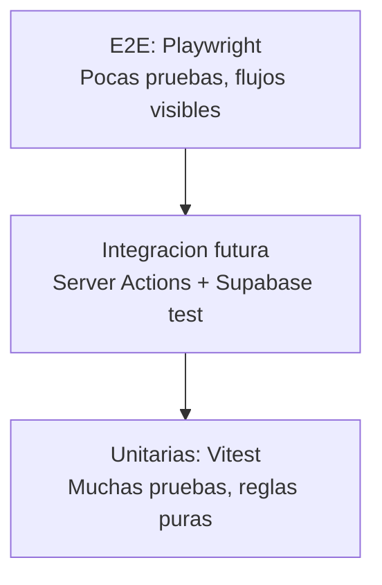

# Estrategia de pruebas

Este documento explica como se valida la calidad del MVP de Andina de Alimentos.
La estrategia esta pensada para un equipo pequeno y un proyecto academico con
aspiracion a produccion.

## Objetivo

```txt
Reducir errores antes de entregar, desplegar o presentar el sistema.
```

No se busca probar absolutamente todo. Se prueban primero las partes que tienen
mayor riesgo:

- roles y rutas;
- validaciones;
- calculos de pedido;
- estados de pedido;
- formularios principales;
- navegacion publica;
- build de produccion.

## Piramide de pruebas



Interpretacion:

```txt
Muchas pruebas unitarias para reglas rapidas.
Algunas pruebas E2E para confirmar que la app abre y navega.
Mas adelante, pruebas de integracion para flujos con base de datos.
```

## Herramientas usadas

### Vitest

Uso:

```txt
Pruebas unitarias rapidas.
```

Comando:

```powershell
npm.cmd test
```

Archivos:

```txt
src/lib/auth-routes.test.ts
src/lib/format.test.ts
src/lib/orders/pricing.test.ts
src/lib/validators/orders.test.ts
src/lib/validators/products.test.ts
src/lib/validators/sellers.test.ts
src/domain/orders/status.test.ts
```

Que valida:

- rutas por rol;
- zona horaria Bolivia;
- calculo de precios y descuentos;
- validacion de pedidos;
- validacion de productos;
- validacion de vendedores;
- transiciones de estado de pedidos.

### Playwright

Uso:

```txt
Pruebas E2E en navegador real.
```

Comando:

```powershell
npm.cmd run test:e2e
```

Archivo:

```txt
tests/e2e/public-navigation.spec.ts
```

Que valida:

- pagina inicial carga;
- links principales existen;
- navegacion hacia login funciona;
- formulario de login se muestra;
- se prueba en escritorio y vista movil.

### ESLint

Uso:

```txt
Detectar problemas de calidad, convenciones y errores comunes.
```

Comando:

```powershell
npm.cmd run lint
```

### Next.js build

Uso:

```txt
Confirmar que el proyecto compila como produccion.
```

Comando:

```powershell
npm.cmd run build
```

Valida:

- TypeScript;
- rutas;
- componentes;
- imports;
- server/client boundaries;
- compilacion de produccion.

## Comando principal de calidad

El comando recomendado para revision es:

```powershell
npm.cmd run test:all
```

Ejecuta:

```txt
1. ESLint
2. Vitest
3. Playwright
4. Next.js build
```

Este comando funciona como una puerta de calidad antes de:

- hacer commit importante;
- subir a GitHub/GitLab;
- hacer merge a main;
- presentar el proyecto.

## Preparacion en una computadora nueva

Primera instalacion:

```powershell
npm install
```

Instalar navegador de Playwright:

```powershell
npx.cmd playwright install chromium
```

Luego:

```powershell
npm.cmd run test:all
```

## Cobertura actual por riesgo

| Riesgo | Prueba actual |
| --- | --- |
| Vendedor entra a admin | Unit tests de rutas por rol |
| Rutas inseguras de login | Unit tests de auth-routes |
| Pedido sin productos | Unit tests de validators/orders |
| Producto con promocion invalida | Unit tests de validators/products |
| Vendedor con nombre invalido | Unit tests de validators/sellers |
| Hora incorrecta | Unit test de format |
| Calculo incorrecto de descuento | Unit test de pricing |
| Estado de pedido invalido | Unit test de domain/orders/status |
| Login no visible | E2E de login |
| Home o navegacion rota | E2E de navegacion publica |
| Error de TypeScript/produccion | Next build |

## Que no se prueba todavia

Todavia no hay pruebas automaticas completas para:

- login real con usuarios Supabase;
- creacion real de pedido en base de datos;
- aprobacion real de pedido;
- reserva y restauracion de stock con datos de prueba;
- RLS ejecutado contra una base aislada;
- Server Actions con mocks o Supabase local.

Esto no invalida el MVP. Significa que la siguiente etapa de calidad seria
agregar pruebas de integracion.

## Proximas pruebas recomendadas

### 1. Flujo vendedor crea pedido

Objetivo:

```txt
Probar login de vendedor, seleccion de producto y creacion de pedido.
```

Requiere:

- usuario vendedor de prueba;
- datos de productos estables;
- base de datos de pruebas o Supabase dev.

### 2. Flujo admin aprueba pedido

Objetivo:

```txt
Probar login admin, aprobacion de pedido y cambio de estado.
```

### 3. Stock reservado

Objetivo:

```txt
Confirmar automaticamente que crear pedido descuenta stock y rechazarlo lo restaura.
```

### 4. RLS

Objetivo:

```txt
Confirmar que un vendedor no puede ver pedidos de otro vendedor.
```

## Relacion con calidad y entrega de valor

Concepto del curso:

```txt
Shift left: encontrar errores temprano.
```

Aplicacion:

```txt
Vitest detecta errores de reglas antes de abrir el navegador.
ESLint detecta problemas antes del build.
Playwright detecta fallas visibles de navegacion.
Next build valida que la app puede compilar para produccion.
```

Concepto del curso:

```txt
Gate de calidad.
```

Aplicacion:

```txt
npm.cmd run test:all debe pasar antes de considerar estable una mejora.
```

## Como defenderlo

Respuesta corta:

```txt
Usamos una estrategia de pruebas por niveles: unitarias para reglas de negocio,
E2E para flujos visibles, lint para calidad de codigo y build para validar
produccion.
```

Respuesta tecnica:

```txt
Vitest valida reglas puras como descuentos, estados de pedido y validadores.
Playwright abre la app en navegador real y valida navegacion basica. ESLint y
Next build sirven como controles adicionales antes de subir cambios.
```

Respuesta honesta:

```txt
Todavia faltan pruebas de integracion con Supabase aislado. Estan identificadas
como siguiente mejora porque requieren una base de datos de pruebas o Supabase
local.
```
